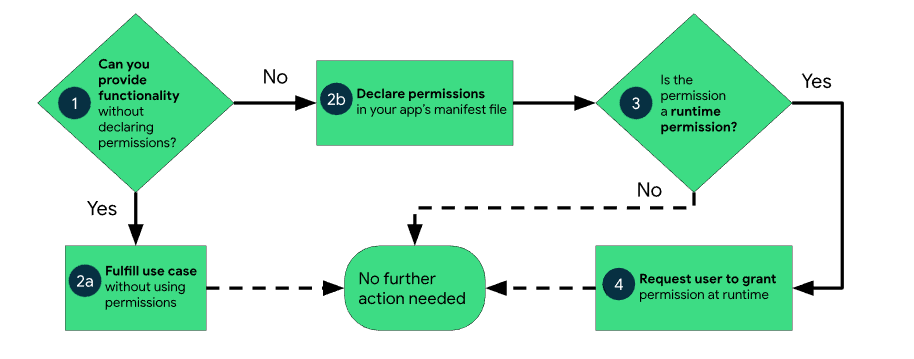

# Permissions

Chaque application roule dans son propre petit monde (sandbox). Si vous avez besoin d'accéder à plus d'information (positionnement GPS, % de batterie, ...) ou de ressources (caméra), vous devrez utiliser les permissions. Voici la liste complète des permissions:

https://developer.android.com/reference/android/Manifest.permission

Il y a des permissions dites normales:

* INTERNET: Accès internet
* BATTERY_STATS: Données de la batterie
* ACCESS_WIFI_STATE
* 
Et des permissions plus dangereuses:

* SEND_SMS
* RECEIVE_SMS
* READ_SMS
* READ_PHONE_NUMBERS

Vous n'avez pas besoin d'avoir la permission pour prendre une photo, vous pouvez simplement utiliser l'intention ACTION_IMAGE_CAPTURE ou pour un vidéo ACTION_VIDEO_CAPTURE. Soyez certain de ce que vous voulez faire avant de demander une permission, il est possible que l'utilisateur refuse.

Pour plus d'alternatives, consultez la page : 
https://developer.android.com/training/permissions/evaluating


## Utilisation des permissions




Pour les déclarer, il est nécessaire de les identifier dans le Manifest en utilisant la notation suivante, par exemple:

```
<manifest xmlns:android="http://schemas.android.com/apk/res/android"
          package="com.example.android.basicpermissions">

<uses-permission android:name=”android.permission.WRITE_EXTERNAL_STORAGE” />
<uses-permission android:name=”android.permission.READ_EXTERNAL_STORAGE” />

<application>
...
```


Si vous souhaitez utiliser une permission dangereuse, vous devrez valider avec l'utilisateur en runtime.

### Demande runtime des permissions

Principe de base:
* Demander seulement au besoin
* N'empêcher pas l'utilisateur d'utiliser le reste de votre application

En ordre:

1. ContextCompat.checkSelfPermission() permet de déterminer si la permission a déjà été demandé.

2. Si checkSelfPermission return false, vous pouvez appeler la méthode shouldShowRequestPermissionRationale() et expliquer pourquoi vous avez besoin de la permission.

3. requestPermissions()

### Deux façons de faire

Ce qu'Android suggère de faire est d'utiliser la classe android ActivityResultContracts et d'attendre la réponse à la demande pour l'utilisateur:

2 méthodes existent pour requérir des permissions:

* requestPermission (1 seule permission)
* requestMultiplesPermissions (plusieurs permissions)

```
when {
    ContextCompat.checkSelfPermission(
            CONTEXT,
            Manifest.permission.REQUESTED_PERMISSION
            ) == PackageManager.PERMISSION_GRANTED -> {
        // You can use the API that requires the permission.
    }
    shouldShowRequestPermissionRationale(...) -> {
        // In an educational UI, explain to the user why your app requires this
        // permission for a specific feature to behave as expected. In this UI,
        // include a "cancel" or "no thanks" button that allows the user to
        // continue using your app without granting the permission.
        showInContextUI(...)
    }
    else -> {
        // You can directly ask for the permission.
        // The registered ActivityResultCallback gets the result of this request.
        requestPermissionLauncher.launch(
                Manifest.permission.REQUESTED_PERMISSION)
    }
}

// Register the permissions callback, which handles the user's response to the
// system permissions dialog. Save the return value, an instance of
// ActivityResultLauncher. You can use either a val, as shown in this snippet,
// or a lateinit var in your onAttach() or onCreate() method.
val requestPermissionLauncher =
    registerForActivityResult(RequestPermission()
    ) { isGranted: Boolean ->
        if (isGranted) {
            // Permission is granted. Continue the action or workflow in your
            // app.
        } else {
            // Explain to the user that the feature is unavailable because the
            // features requires a permission that the user has denied. At the
            // same time, respect the user's decision. Don't link to system
            // settings in an effort to convince the user to change their
            // decision.
        }
    }

```

https://gitlab.com/drynish/ecole/-/tree/master/420-C56%20---%20Programmation%20mobile/Android/Exemples/3.1%20-%20Permissions%20simples

L'autre façon est de gérer nous-mêmes les possibilités:

```
when {
    ContextCompat.checkSelfPermission(
            CONTEXT,
            Manifest.permission.REQUESTED_PERMISSION
            ) == PackageManager.PERMISSION_GRANTED -> {
        // You can use the API that requires the permission.
        performAction(...)
    }
    shouldShowRequestPermissionRationale(...) -> {
        // In an educational UI, explain to the user why your app requires this
        // permission for a specific feature to behave as expected. In this UI,
        // include a "cancel" or "no thanks" button that allows the user to
        // continue using your app without granting the permission.
        showInContextUI(...)
    }
    else -> {
        // You can directly ask for the permission.
        requestPermissions(CONTEXT,
                arrayOf(Manifest.permission.REQUESTED_PERMISSION),
                REQUEST_CODE)
    }
}

override fun onRequestPermissionsResult(requestCode: Int,
        permissions: Array<String>, grantResults: IntArray) {
    when (requestCode) {
        PERMISSION_REQUEST_CODE -> {
            // If request is cancelled, the result arrays are empty.
            if ((grantResults.isNotEmpty() &&
                    grantResults[0] == PackageManager.PERMISSION_GRANTED)) {
                // Permission is granted. Continue the action or workflow
                // in your app.
            } else {
                // Explain to the user that the feature is unavailable because
                // the features requires a permission that the user has denied.
                // At the same time, respect the user's decision. Don't link to
                // system settings in an effort to convince the user to change
                // their decision.
            }
            return
        }

        // Add other 'when' lines to check for other
        // permissions this app might request.
        else -> {
            // Ignore all other requests.
        }
    }
}
```

Exemple copié de google

https://gitlab.com/drynish/ecole/-/tree/master/420-C56%20---%20Programmation%20mobile/Android/Exemples/3.2%20-%20PermissionsActivityResultKotlin


Pour plus de détails:

https://developer.android.com/training/permissions/requesting


# Fichiers

## Choix emplacements 

Vous pouvez sauver vos fichiers directement à l'intérieur de l'espace disque de l'application. Habituellement, l'espace utilisé est privé que pour votre application et aucune autre application ne peut la lire (ni même un utilisateur). Quand l'utilisateur efface votre application, les fichiers sont retirés du même coup.

Tous les appareils Android possèdent deux emplacements de stockage disponible : interne et externe. Ils proviennent des premières années d'Android lorsque certains appareils offraient un emplacement non volatile de mémoire (interne) et un emplacement externe (carte micro sd). De nos jours, certains appareils partagent la mémoire interne en deux, une étant une partition interne et l'autre externe.

Si vous voulez lire un fichier à l'exécution, vous pouvez utiliser le répertoire res/raw/ et utiliser les méthodes openRawResource() en lui passant comme paramètre le R.raw.<filename> ce qui retournera un InputStream que l'on pourra utiliser pour lire le fichier  cependant vous ne pourrez le modifier s'il est compilé ainsi (bien sûr).

## Stockage interne

* Toujours disponible
* Les fichiers ne sont accessibles que par votre application, ou en root (rooter un téléphone).
* Meilleur emplacement quand vous voulez être certains que ni l'utilisateur ni aucune autre application ne doit accéder à vos  données
* Aucune permission nécessaire
* Fichiers effacés à la désinstallation de l'application.

getFilesDir() 


## Stockage externe

* Pas toujours disponible, l'utilisateur peut le transférer en USB et cela peut le rendre inaccessible à tout moment.
C'est disponible en lecture pour tous (surtout lorsque connecté à l'utilisateur)
* Lors de la suppression de votre application, les fichiers se font effacés seulement s'ils sont stockés dans le répertoire suivant : getExternalFilesDir().
Bien sûr, contrairement au stockage interne, c'est la meilleure place pour partager des fichiers avec les autres applications.

getExternalFilesDir(): permet de déterminer l'emplacement de l'espace de stockage externe

## Permissions accès fichiers externes

Après la version 19, pour écrire vers le stockage externe, la permission WRITE_EXTERNAL_STORAGE doit être spécifiée dans le Manifest et pour lire, READ_EXTERNAL_STORAGE.


